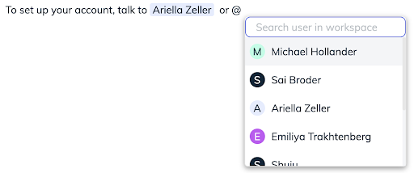
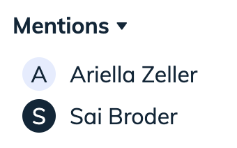
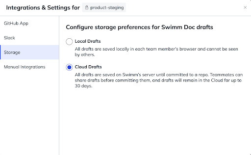
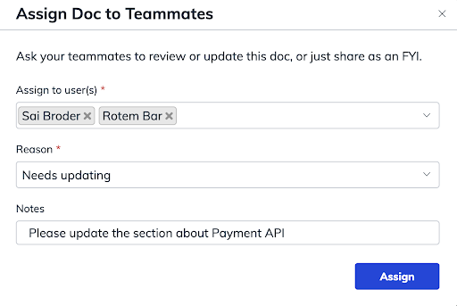
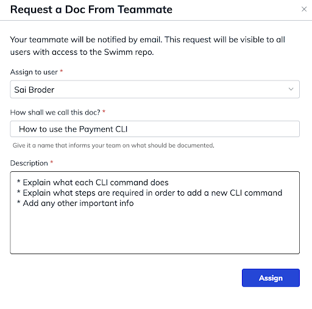
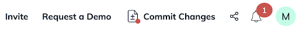
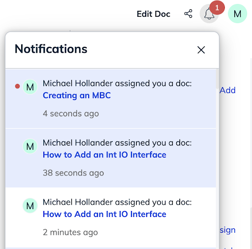

import useBaseUrl from '@docusaurus/useBaseUrl';
import Link from '@docusaurus/Link';

# Doc Sharing, Editing, and Collaboration

### Mentions in docs

You can mention specific Swimm users in a doc by typing `/mention` and selecting a user.

All mentioned users inside a doc will appear on the right sidebar for added visibility.

### Sharing doc drafts with your team

You can share a doc draft with your teammates in order to get it reviewed, via Cloud Drafts.
To make this possible, an admin in your workspace needs to enable a setting from the Integrations & Settings popup available via the left sidebar after hovering over the desired repo.

A Cloud Draft will remain in the Cloud for up to 30 days. A local version of a draft will still be available after the cloud draft expires unless the draft was already committed.

### Assigning docs
You can ask your teammates to review or update a particular doc or just share it as an FYI. This is possible with the “Assign” feature in Swimm located on the right sidebar. You can assign a doc to one or more Swimm users or email addresses. 

You can choose from a predefined set of reasons (needs review, needs updating, FYI, other) and assign it and include an optional note. After assigning a doc, the assignees will receive a notification along with the assignment details. 

You can see all assignments for a particular doc (your assignments will appear first) by hovering over the “Assignees” label. 

Assignments assigned to you will contain a “Mark as Complete” icon, which when clicked will mark the assignment as completed, and the assigner will automatically receive a notification in such case telling them the assignment was successfully completed. 

Alternatively, if the assignment is no longer relevant, the assignee or assigner of an assignment can remove an assignment by clicking the delete icon.

### Requesting docs

You can ask your teammates to create a new doc by using the Doc Requests feature.
This feature is available by going to a specific repository in Swimm, clicking the “New” button, and selecting “Request a Doc”. You can see a list of all doc requests by clicking the “Doc Requests” tab. Note that doc requests are visible to all users with access to the Swimm repo.

By creating a doc request, you should explain what type of doc you need by writing what the name of the doc should be (a name that informs your teammate on what should be documented) and by entering a description that will help your teammate better understand your request.

Once you’ve assigned a request to a teammate, they will be notified by email. 

### Notification Center

At the top area of your screen, you’ll see there is a notification area to edit your docs. 
When there is a new notification, there will be a red dot over the bell.

Under Notifications, you’ll see the following:
1. The notification will be white if you’ve clicked on it
2. The notification will be blue if you have not clicked on it yet
3. When you have a new notification, you’ll see that it’s blue with a red dot. This will let you know that it’s the first time you’ve seen the notification. Once you close the notification, the red dot disappears.

### Doc sidebar 

All of the meta information for your documentation can be found in the right-hand sidebar.

This includes the following:

- General information (doc creation date, last updated etc)
- Review Auto-sync (with repo docs)
- The doc’s referenced files (with repo docs)
- A Table of Contents
- Click on the Table of Contents entry to navigate to a specific section in the doc.

