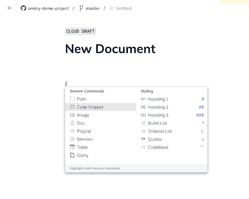
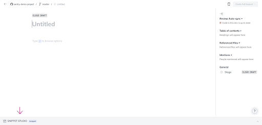
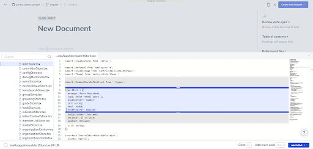

import useBaseUrl from '@docusaurus/useBaseUrl';
import Link from '@docusaurus/Link';

### Snippet Studio 

Swimm’s Snippet Studio allows you to add live snippets from your repositories. 

You can access Snippet Studio from the Slash command “Code Snippet” anywhere in the document while you’re editing, or by clicking the Snippet Studio bar at the bottom of the doc.

The Snippet Studio opens to a blank page:

### **How to Add a Snippet to a Document**

From the left sidebar in the Snippet Studio, you can add a snippet once you locate the file containing your code. You can navigate by using the tree view or by using the search bar if you know the file name. Note that the selection area is marked with gray and blue backgrounds. 

The gray background is also called the “Context area” of a doc, serving as an area to reference selected lines of code. This section is not reviewed and updated with Auto-sync.

After you’ve found and selected your code file, the content will be displayed on the main area of the page. You can select any number of lines from the file as can be seen below.

:::tip Tip
You can also use Swimm’s Snippet Studio entirely from the keyboard. Use up and down to navigate in the file. Use Shift + Up or Shift + Down to mark and enter to set the selection. To add the snippet to the document, click “Add & Exit” or use “Enter”

:::

:::tip Tip
You can add more than one snippet by hitting Shift+Enter.
You can also continue adding snippets from different files at a single time.
:::

### Smart Tokens 

Smart Tokens are an important Swimm feature enabling you to write documents that are interwoven with code. These code references (Smart Tokens) serve an integral part of the document sentences and paragraphs. 

Consider the following technical description:
“Our Notification mechanism includes a `notificationSubsciberClass` and a `notificationPublisherClass`” where the emphasized words are references to real classes. 

With Smart Tokens these references are bundled with the latest code.

Swimm offers a convenient interface to fetch these Smart Tokens. Swimm’s auto-complete interfaces with Smart Tokens to offer suggestions for keywords. It shows the suggestions and a few lines of code surrounding it from your codebase.

**How do Smart Tokens work?​**

To create a Smart Token, type a backtick ` anywhere in your document, and then begin typing. Swimm will show suggestions with our autocomplete interface.

With Smart Tokens, you won't need to worry about the impact of refactoring on your documentation, as well as renaming constants or variables. Even class and method names won't require you to update your documentation wherever they're mentioned. 

### Smart Paths

Similar to Smart Tokens, Smart Paths also help keep your docs updated but function a bit differently. With Smart Paths, you add a path to a file or to a folder. You don't have to worry about changing file names or even changing the directory structure around. Swimm keeps track of all of that for you.
