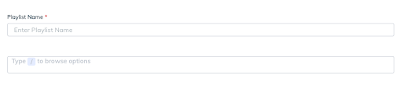
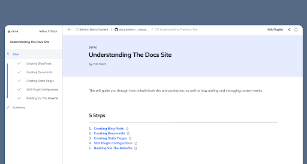

import useBaseUrl from '@docusaurus/useBaseUrl';
import Link from '@docusaurus/Link';

# Swimm Playlists 

A Swimm Playlist is just what it sounds like: a collection of documents, links, videos, Markdown files, and images stored as a Playlist collection in a particular order. They can be shared with anyone in a Swimm workspace and changes are tracked with git, with all the benefits of commits and branches. 

Swimm keeps track of progress in a Playlist so onboarders don’t have to remember where they left off.

### **Common usages of Playlists are:**

- An onboarding program for an individual or a role
- A topic that needs to be consumed as a collection 
- A topic that has sequential order and needs to be viewed as a flow

However, there is no correct way to use Playlists.

### **How to create & edit Playlists​**

To create a Playlist, first, go into your repo, and then click on the plus sign next to Playlists.

This will bring up a pop-up to enter the Playlist name and begin browsing to select "Docs" and "Links" you want to include.

### **Reviewing Playlists​**

Open a Swimm Playlist and you’ll see that at the bottom of every page, there’s an option to mark it as read. You can begin reviewing a Playlist and stop at any point. 
Swimm will always keep track of where you’ve left off.

### **How to add a Playlist to a doc and/or add another Playlist​**

In the Swimm Editor, type "/" to show the editor options.

Choose "Playlist" and navigate to the Playlist you'd like to select.

