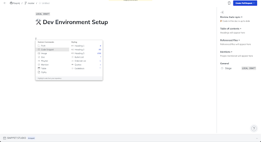
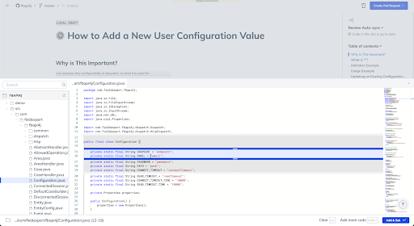
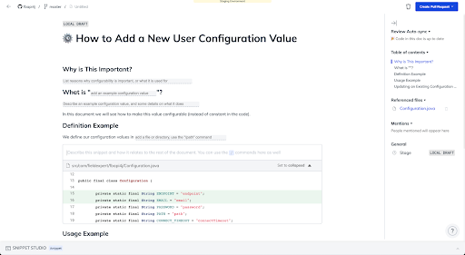

import useBaseUrl from '@docusaurus/useBaseUrl';
import Link from '@docusaurus/Link';

**Step 1: Select your favorite method**
We recommend a few different options to start creating documentation.

**Blank Doc** - Just as it sounds, this is a blank doc page. Choose this option if you are clear about what you want to write.

**Pull Request** - We pull all the code parts from any PR as a scaffold for creating your doc. 

**Guided Doc Creation** - Use Swimm’s walkthrough assistive wizard to follow step-by-step best practices for creating documentation. 

**Step 2: Use Swimm’s code-coupled editor to edit and add content**

Swimm’s slash editor commands are a great way to quickly create and edit content in your documents. 
There are two types of commands:
- Styling: “bold”, “heading”, “blockquote”, “list”, and so on.
- Swimm commands: “snippet,” “path,” “doc,” and “playlist”
 
To use these commands, type “/” at any line. 

You will see the commands menu.

To pick a command, start typing its name followed by “Enter” or just click on it.
 
Important Swimm Commands:
- Path - Add a path of a directory or a file in your document. Swimm will track it in case it is renamed, moved, or deleted. 
- Doc - Add a link to an existing Swimm doc. Swimm will track it in case it is getting out of date and notify. 
- Playlist - Add a link to an existing Playlist. Swimm will track it and notify you if it’s out of date. 
- Code Snippet - Add a live code to your document with code snippets. Once you select a code snippet command, Swimm’s Snippet Studio will appear and help you locate a file and then select a certain section from it. Once you have selected the code section, click “Add & Exit” (or press “Enter”).
- Mention - Mention a teammate associated with the document. Swimm will track if the user is no longer part of the workspace.

**Step 3: Add your first code snippet**
Type /Snippet and select to add a code snippet. Snippet Studio will show up.

Snippet Studio provides you with an easy way to locate a file and select a certain section from it. Once you have selected the code section, click “Add & Exit” (or press “Enter”).

This will add the Code snippet to your document.

Above the snippet, you will see an area to describe and write about the snippet. This part does not need to be long. Best to just describe what the snippet does.

**Step 4: Add Smart Tokens.**
Smart Tokens help you keep your documentation up to date by allowing you to reference parts of your code even outside of snippets in a way that automatically updates when the code changes.

The most common use for Smart Tokens is referencing variable, method, or function names within the document. 

Read more about how Smart Tokens work.

**Step 5: Save and commit:**

1. Click on the “Create Pull Request” button in the top right corner.
2. Create a new branch to start a PR or push to an existing branch.

All docs will be saved under the .swm folder once the docs are committed to the repo.
