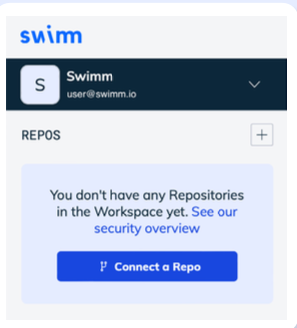
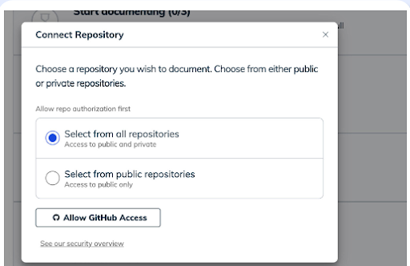
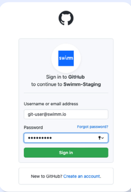

id: Connecting & Authorization of Repos
slug: connecting-authorization-repos
sidebar_position: 3
---
import useBaseUrl from '@docusaurus/useBaseUrl';
import Link from '@docusaurus/Link';

Once you've created your first workspace, you'll need to add your repositories.
**Step 1:** From the main workspace menu, on the left side, click “Connect a Repo” from the sidebar.

**Step 2:** Connect your repository. Select a public or private repo and click on “Allow GitHub Access.”

**Step 3:** Sign into GitHub

**Step 4:** Search and then select the repository you plan to document. At this point, you can get started creating or reviewing documentation. 

If you don't see the repository you wish to add, it's because Swimm doesn't have the correct permissions. Click the Manage GitHub Scope button at the bottom of the dialog box:

If you still can't find your repo, please reach out to us on our <SwimmLink target="slack"
