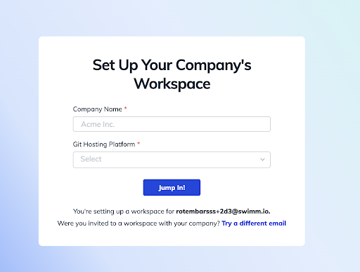
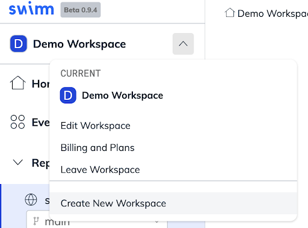

import useBaseUrl from '@docusaurus/useBaseUrl';
import Link from '@docusaurus/Link';

After you've completed the sign up process, you’ll be able to set up your workspace page. 

**You have two options**:
- Join your company’s existing workspace, (if they’ve set up a workspace already) or 
- Create your own workspace

Note that if you want to create an additional workspace, you can do it from within the app.

You can set up Swimm Workspaces with multiple repositories. At the top of the workspace menu, there's an option to add more workspaces.

**How many workspaces should I have?**

Every organization is different, so it really depends on your needs. Most Swimm users have a separate workspace for their teams.

We suggest that you begin setting your Swimm workspace right away.

