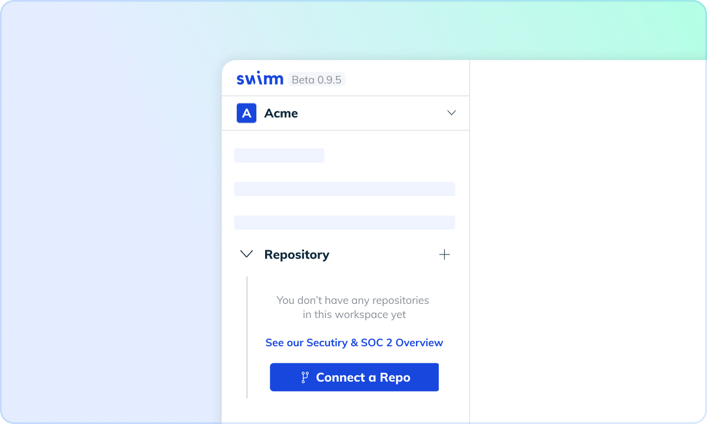
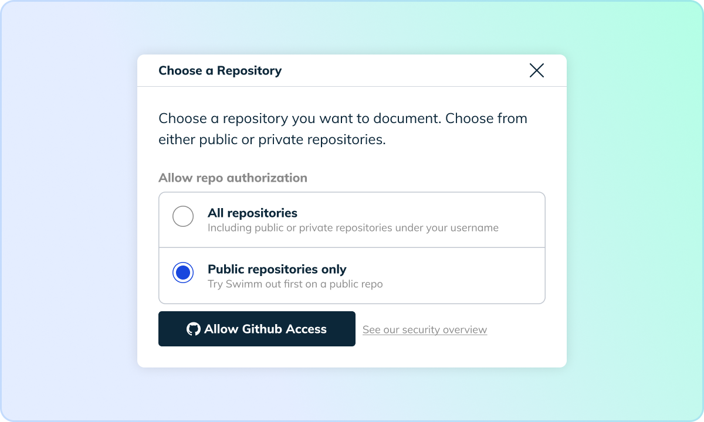
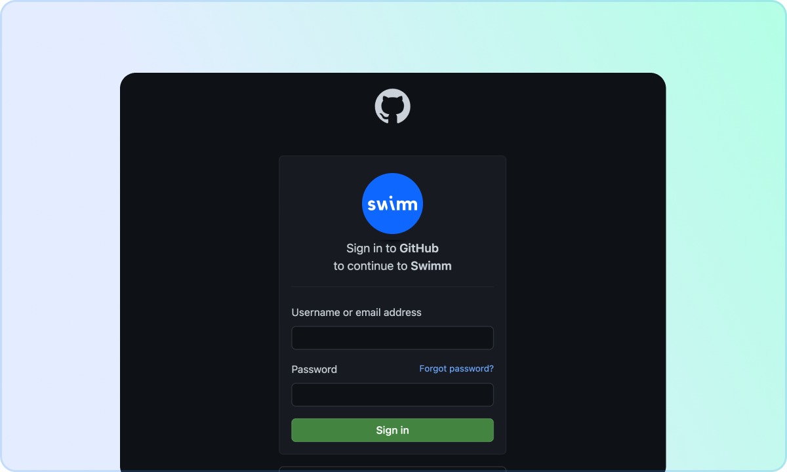
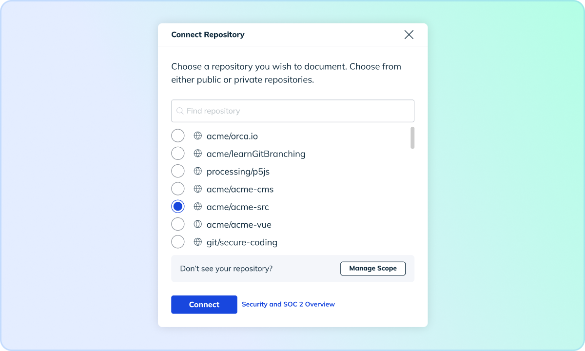
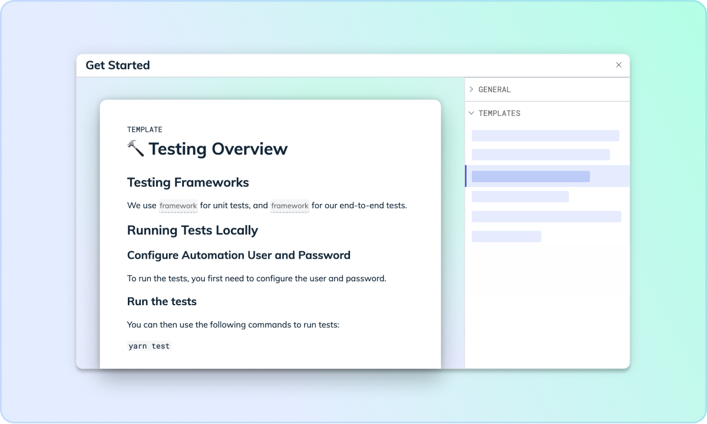
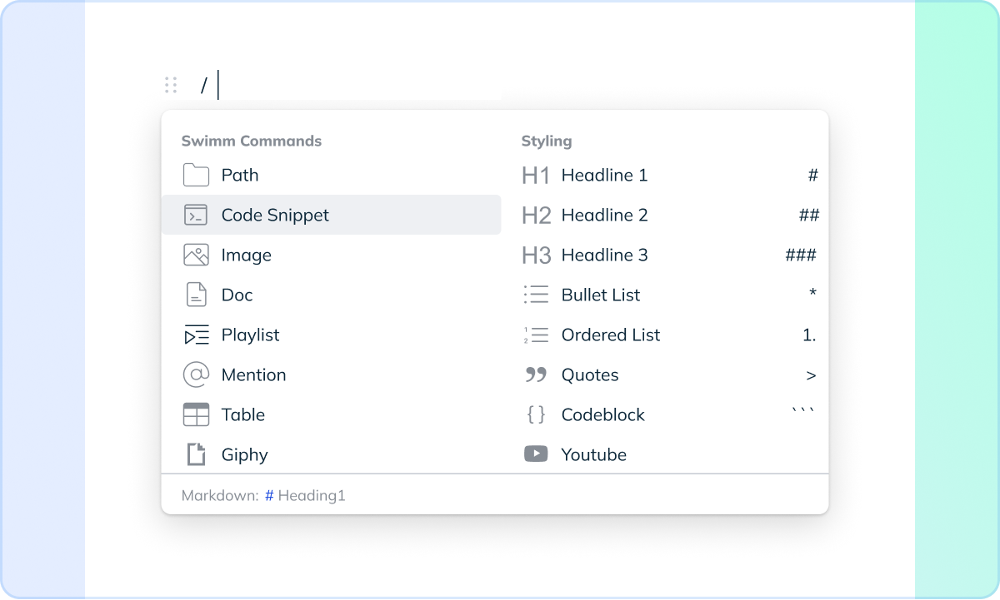
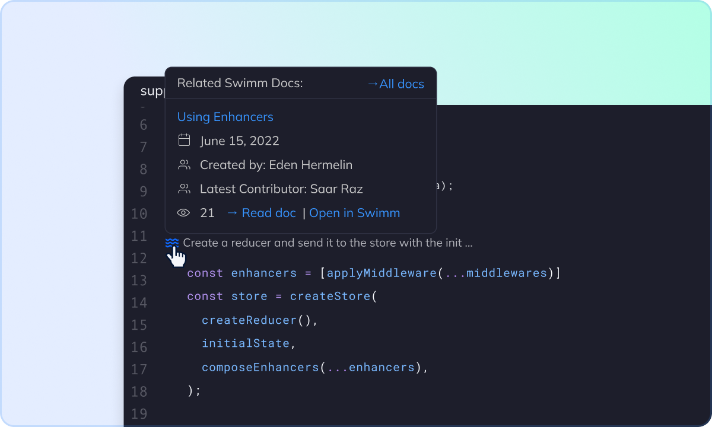
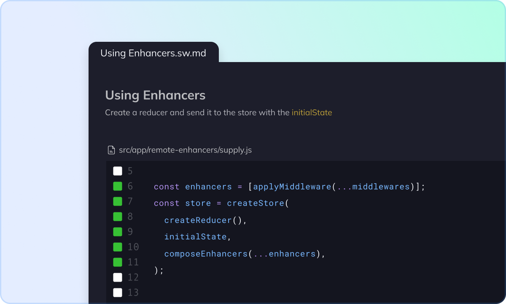
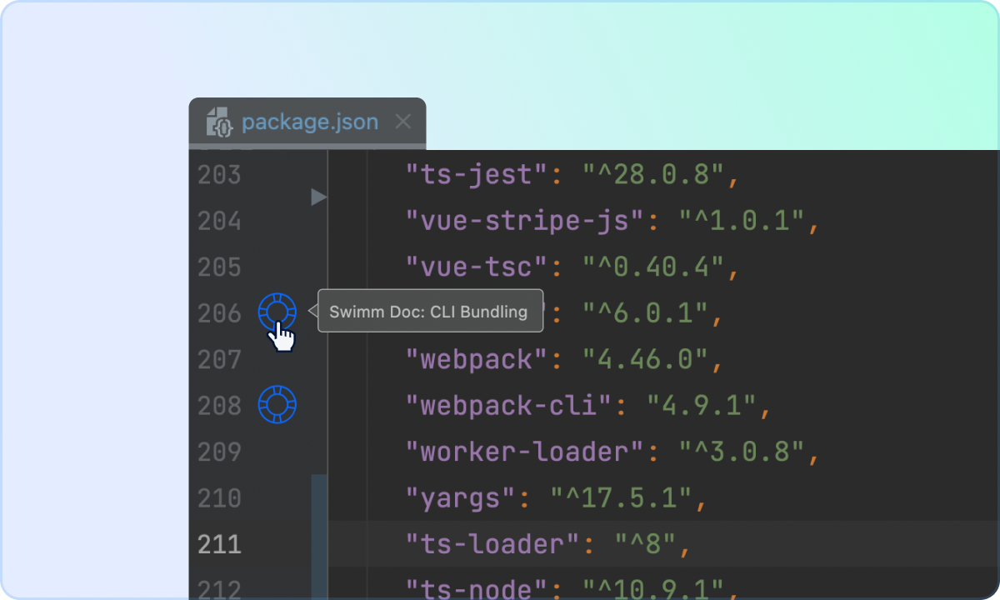
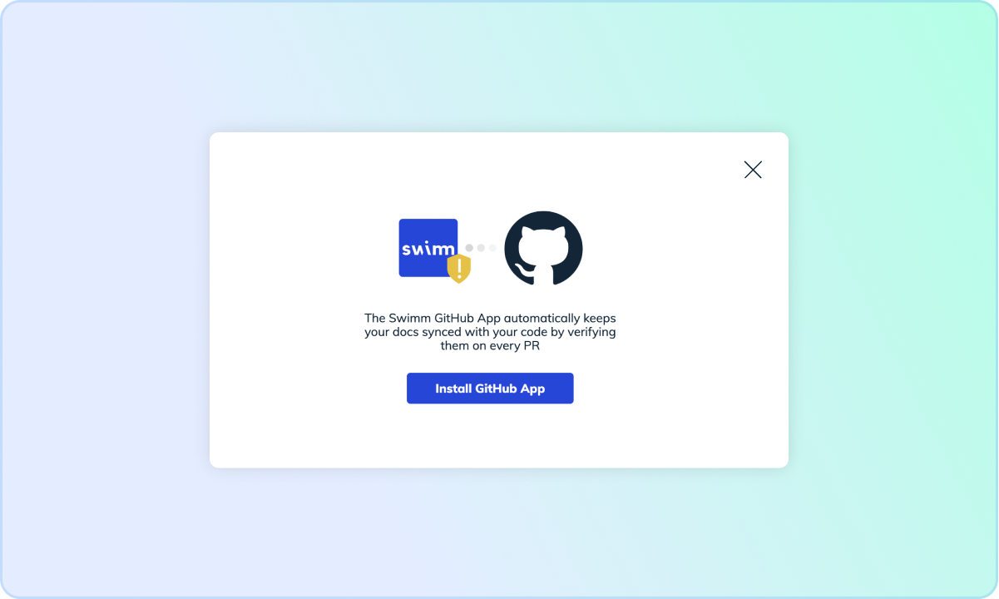

import Link from '@docusaurus/Link';

To get started with Swimm, we suggest running through this Quick Start Guide we've created.  

:::info Highly Recommended
<Link to="https://swimm.io/quick-start-guide.pdf" 
    className="button button--secondary button--lg">Check Out Swimm's Quick Start Guide</Link>
:::

**Get Started With Swimm**   

Bring documentation to your team to make knowledge sharing faster, easier, and coupled to code.

# Add a Repository

Once your workspace is set up, connect your GitHub repository.

**Step 1: Click "Connect a Repo" from the sidebar.**

 **Step 2:  Connect your repository. Select from either "All repositories" or "Public repositories only" and then click "Allow GitHub Access."**

  

  **Step 3: Sig into GitHub.**

   

   **Step 4: Select your repository.**

# Create Your First Doc

**If you're asking yourself, "Where do I start?" here are a few quick tips.**

On the documentation front, starting small is absolutely fine! 

:arrow_right: Select a **Code Snippet** and write notes to walk another developer through the code

:arrow_right: Review Draft Documentation from your **Pull Requests** that Swimm creates automatically for you

:arrow_right: Use on of **Swimm's Templates** to help you get a documentation jump start

 

 **To Add a Swimm Snippet**

 :white_check_mark: Click on / and choose "snippet" from the dropdown

 :white_check_mark: Highlight the code using your mouse

 :white_check_mark: Click enter to add the code snippet

 :white_check_mark: Click Esc to go back to the editor

 **To Save and Committ:**

 :white_check_mark: Click on the "Create Pull Request" button in the top right corner

 :white_check_mark: Create a new branch to start a Pull Request or push to an existing branch

 All docs will be saved under the .swm folder once the docs are committed to the repo.

 # Integrate Your IDE

:white_check_mark: Install and enable the Swimm plugin for VS Code or IntelliJ

:white_check_mark: If you are using VS Code, once you click on the Swimm icon, the IDE will open a new tab containing your Swimm Doc

:white_check_mark: If you are using IntelliJ, click on the Swimm buoy, and the IDE will open a new tab containing your Swimm Doc

 # Installing the GitHub App

 Swimm's GitHub App will verify that all your documents are updated on every Pull Request

 :white_check_mark: Click on **Integrations** in the top right corner

 :white_check_mark: Click on **Install GitHub App**

 

  # Documentation Use Cases   

:ocean: **Onboarding**

Create documentation to ramp up onboarding new developers and engineers with Swimm Playlists

:ocean: **Complex Code**

Create documentation for complex code and nonstandard processes that is confusing and requires more information

:ocean: **Knowledge Silos**

Create documentation to eliminate legacy code and promote inclusive teams & knowledge sharing

