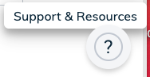
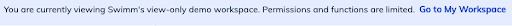

import useBaseUrl from '@docusaurus/useBaseUrl';
import Link from '@docusaurus/Link';

Swimm created a public view-only demo workspace to serve as a quick introduction & overview of Swimm’s platform. 

 

The workspace, Sentry’s Public repository, is real - so you’ll be able to see how Sentry’s engineering team has been using Swimm to create their documentation. 

We hope that checking out this demo workspace will inspire you to explore Swimm.
## How to get to Swimm’s Demo workspace

Click on the Help Center inside the app, which is the question mark icon (Support & Resources) in the lower-right corner of your screen.

## How to use Swimm’s demo workspace

The best way to use Swimm’s demo workspace is to just begin exploring different docs and Playlists as an example of how you might plan to create your own workspace. 

Note that Swimm’s demo workspace is a view-only space; you cannot create and edit docs. 

As you’re exploring, be sure to check out different docs and Playlists on the repo page. As you open these docs, you’ll notice Swimm features include live code snippets, Smart Paths, and Smart Tokens.

When you’re ready to navigate to your own workspace, simply click “Go to My Workspace” on the blue banner on the top of your screen.

